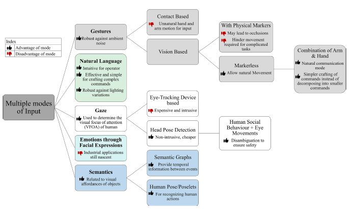

# MRSI Thesis - Robot Action Anticipation for Collaborative Assembly Tasks

MRSI Thesis latex files and notes

## Synthesis

### Data Sources

- rgb/rgbd images (sometimes with optical trackers) including:
    - pose
    - gaze
    - hand gestures
    - emotions through facial expressions
    - object information

- voice commands

### Algorithms

- lookup table containing variations of assembly sequences
- nearest neighbor
- hand-coded contingency trajectory
- recurrent neural network
- openpose
- stochastic (Bayesian) LSTM model
- Convolution neural network
- unsupervised learning
- reinforcement learning (Q-learning, SARSA)
- decision tree
- SVM

## Articles

| Title | Publisher | Year | Notes
| :----: | :----: | :----: | :----: |
| [Anticipative interaction primitives for human-robot collaboration]() | AAAI Fall Symposium - Technical Report | 2016 | [1](./articles/1.md)
| [Action anticipation for collaborative environments: The impact of contextual information and uncertainty-based prediction]() | Neurocomputing | 2021 | [2](./articles/2.md)
| [Anticipation in Human-Robot Cooperation: A recurrent neural network approach for multiple action sequences prediction](https://deepai.org/publication/anticipation-in-human-robot-cooperation-a-recurrent-neural-network-approach-for-multiple-action-sequences-prediction) | Proceedings - IEEE International Conference on Robotics and Automation | 2018 | [3](./articles/3.md)
| [Prediction‐Based Human‐Robot Collaboration in Assembly Tasks Using a Learning from Demonstration Model]() | Sensors | 2022 | [4](./articles/4.md)
| [Fostering short-term human anticipatory behavior in human-robot collaboration](https://www.sciencedirect.com/science/article/pii/S0169814121001591) | International Journal of Industrial Ergonomics | 2022 | [5](./articles/5.md)
| [Rolling-Unrolling LSTMs for Action Anticipation from First-Person Video](https://ieeexplore.ieee.org/document/9088213) | IEEE Transactions on Pattern Analysis and Machine Intelligence | 2021 | [6](./articles/6.md)
| [Predicting the Future: A Jointly Learnt Model for Action Anticipation](https://ieeexplore.ieee.org/document/9009844) | Proceedings of the IEEE International Conference on Computer Vision | 2019 | [7](./articles/7.md)
| [Learning to Anticipate Egocentric Actions by Imagination](https://ieeexplore.ieee.org/document/9280353) | IEEE Transactions on Image Processing | 2021 | [8](./articles/8.md)
| [Social Cobots: Anticipatory Decision-Making for Collaborative Robots Incorporating Unexpected Human Behaviors](https://ieeexplore.ieee.org/document/9473814) | ACM/IEEE International Conference on Human-Robot Interaction | 2018 | [9](./articles/9.md)
| [TTPP: Temporal Transformer with Progressive Prediction for Efficient Action Anticipation](https://arxiv.org/abs/2003.03530) | Neurocomputing | 2021 | [10](./articles/10.md)
| [Action Anticipation By Predicting Future Dynamic Images](https://arxiv.org/abs/1808.00141) | Lecture Notes in Computer Science (including subseries Lecture Notes in Artificial Intelligence and Lecture Notes in Bioinformatics) | 2019 | [11](./articles/11.md)
| [Anticipation in Robotics]() | Springer (Handbook of Anticipation) | 2018 | [12](./articles/12.md)

## Review Articles

| Title | Publisher | Year | Notes
| :----: | :----: | :----: | :----: |
| [A Survey of Robot Learning Strategies for Human-Robot Collaboration in Industrial Settings]() | Robotics and Computer-Integrated Manufacturing | 2022 | [R1](./articles/R1.md)
| [Human–robot collaboration and machine learning: A systematic review of recent research]() | Robotics and Computer-Integrated Manufacturing | 2022 | [R2](./articles/R2.md)

## Videoconferences

[ICARSC2021 Conference Day 1 Morning](https://www.youtube.com/watch?v=cvsTZbZak-M) - minute 34:30

## Ideas

use CNN to classify current posture and RNN works with the sequence of postures

use openpose
https://github.com/CMU-Perceptual-Computing-Lab/openpose

having a lookup table of possible sequences so that considering the current state we have a set of possible next states

## Doubts

Even if there are different sequences of assembly actions can i assume that the person can adapt to the action of the robot if it makes sense

## TODO
resumo em slides:
- metodo, desafio
- ano, fonte, autor
- ferramentas
- article 1, 9, 5, 4, 3, Reviews

In this chapter, we follow Robert Rosen’s definition of an anticipatory system as
“[...] a system containing a predictive model of itself and/or of its environment,
which allows it to change state at an instant in accord with the model’s
predictions pertaining to a later instant.” (Rosen 1985, p.339). Such a system
could be a human, other animal or a robot as long as it is able to anticipate future
states or events. Rosen developed a rigorous theoretical foundation for living
organisms as “anticipatory systems”. -- page 3

## Search Keywords

combination of keywords was used: (‘‘human–robot
collaborat*’’ OR ‘‘human–robot cooperat*’’ OR ‘‘collaborative robot*’’
OR ‘‘cobot*’’ OR ‘‘hrc’’) AND ‘‘learning’’

This set of keywords
was searched in the title, abstract and keywords records of the journal
articles and conference proceedings written in English, from 2015 to
2020.
Inputting this set of search parameters returned a total of 389 results
from ISI Web of Knowledge (191 articles, 198 proceedings), 178 from
IEEE Xplore (48 articles, 130 proceedings) and 486 from Scopus (206
articles and 280 proceedings).

## Sensor links

https://www.bosch-sensortec.com/media/boschsensortec/downloads/development_desktop_software/usermanuals/dd2-0_bhyxxx.pdf
